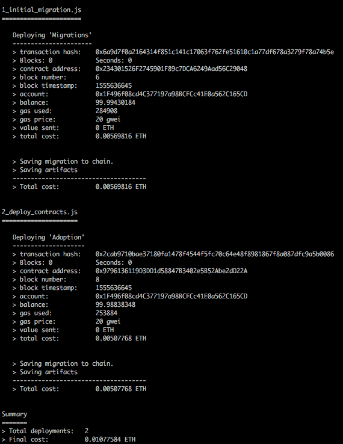
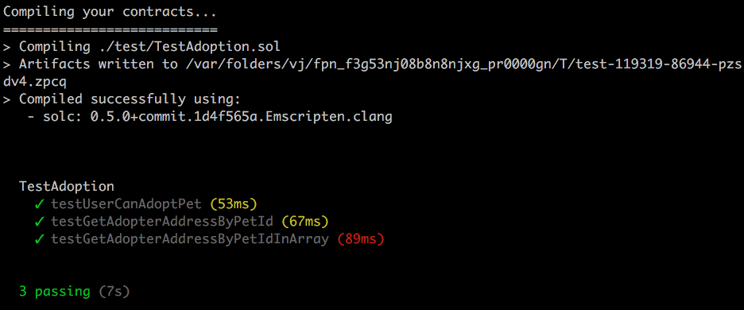

# Solidity Learning


## 1 build a simple contract using Solidity syntax (Tools:Remix,Ganache,MetaMask)


#### 1.1 A simple 'Counter' for counting including 'increment' and 'getNum'

```js
//specify solidity version
pragma solidity >=0.4.22 <0.6.0;

contract Counter{
    // unsigned int
    uint num;
    address owner;

    //declare as public
    constructor() public{
        num=0;
        owner=msg.sender;
    }

    function increment() public{
        if(owner!=msg.sender){
            num+=1;
        }
    }

    //view--only for read
    function getNum() public view returns (uint) {
        return num;
    }
}
```


#### 1.2 Put the code on Remix—Solidity IDE


#### 1.3 Download 'Ganache'

> Quickly fire up a personal Ethereum blockchain which you can use to run tests, execute commands, and inspect state while controlling how the chain operates.


Ganache quickly generated 10 accounts for testing and each of it owns 100 ETH.


#### 1.4 Add 'MetaMask' to google extension

import one account from 'Ganache'——copy address


#### 1.5 Deploy the 'Counter' contract and test

The gas fee is needed to pay by the creator of the transaction. In this contract, I need to pay gas for 'Increment' function because it changes values, but not for 'getNum' function because it is read only.

So, when I click 'increment', it charges me gas.


Then, the transaction will be logged


## 2 Follow Truffle toturial to build Ethereum Pet Shop

[Truffle toturial of building Ethereum Pet Shop]: https://truffleframework.com/tutorials/pet-shop


#### 2.1 "Adoption" - smart contract

```js
pragma solidity ^0.5.0;

contract Adoption{

    //Addresses are Ethereum addresses, stored as 20 byte values.
    address[16] public adopters;

    //adopt a pet
    function adopt(uint petId) public returns (uint){
        //ensure the ID is within range
        require(petId >= 0 && petId <= 15);

        //the address of the person or smart contract who called this function is denoted by msg.sender
        adopters[petId] = msg.sender;
        
        return petId;
    }

    //Retrieving the adopters
    function getAdopters() public view returns (address[16] memory){
        return adopters;
    }
}
```


#### 2.2 Migrate the contract to the blockchain

migrate the contract to the personal blockchain using 'Ganache'




#### 2.3 Smart contract testing

```js
pragma solidity ^0.5.0;

import "truffle/Assert.sol";
import "truffle/DeployedAddresses.sol";
import "../contracts/Adoption.sol";

contract TestAdoption{
    // The address of the adoption contract to be tested
    Adoption adoption=Adoption(DeployedAddresses.Adoption());
    uint expectedPetId=8;
    address expectedAdopter = address(this);

    //test the adopt() function
    function testUserCanAdoptPet() public{
        uint returnedId = adoption.adopt(expectedPetId);

        Assert.equal(returnedId,expectedPetId,"Adoption of the expected pet should match what is returned.");
    }

    //test retrieval of a single pet's owner
    function testGetAdopterAddressByPetId() public{
        address adopter=adoption.adopters(expectedPetId);

        Assert.equal(adopter,expectedAdopter,"owner of the expected pet should be this contract");
    }


    //test retrieval of all pet owners
    function testGetAdopterAddressByPetIdInArray() public{
        // store adopters in memory instead of contract's storage
        address[16] memory adopters=adoption.getAdopters();
        
        //using[], different from the previous one using adoption.adopters()
        Assert.equal(adopters[expectedPetId], expectedAdopter, "Owner of the expected pet should be this contract");
    }
}
```

Running the tests:

