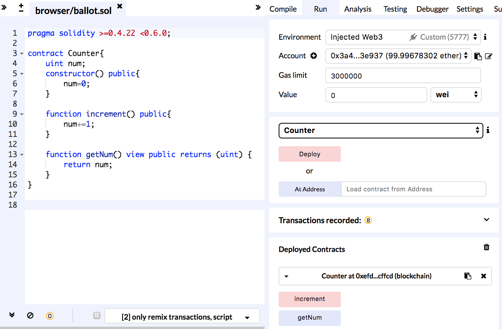
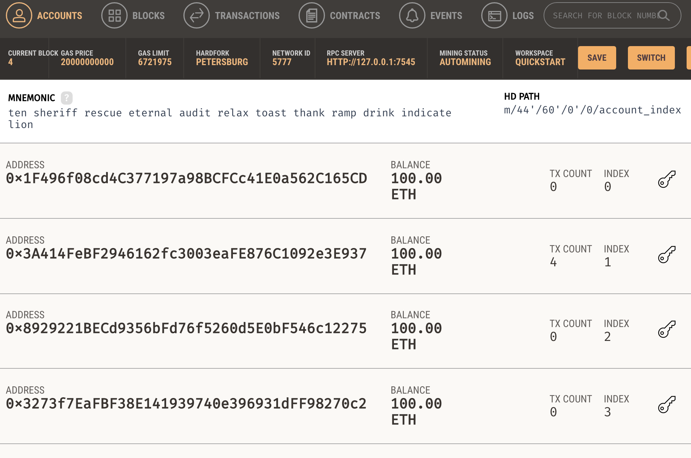
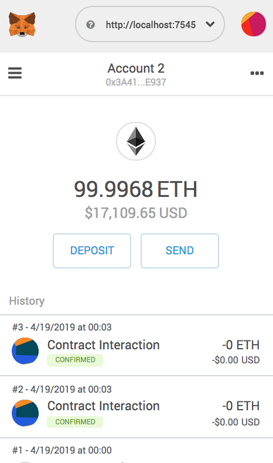
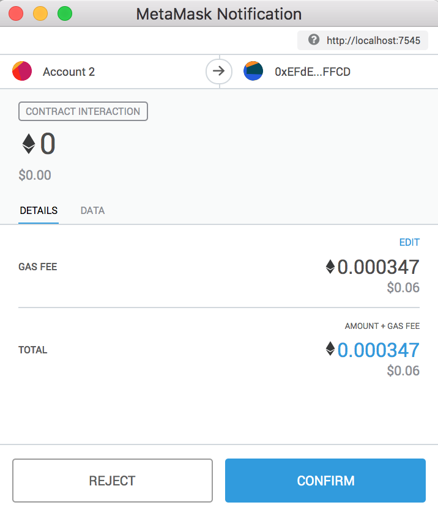
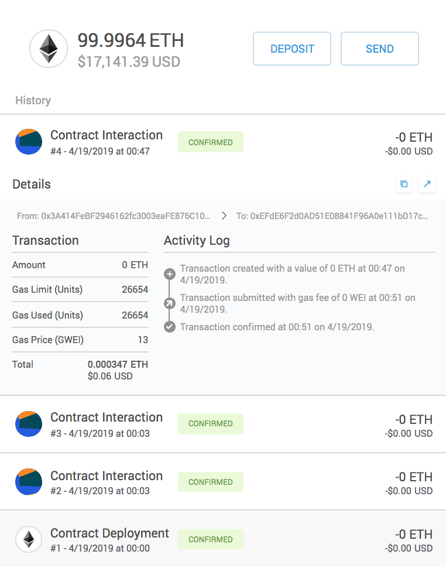

# 1. Solidity Learning


## 1.1 build a simple contract using Solidity syntax (Tools:Remix,Ganache,MetaMask)


#### 1.1.1 A simple 'Counter' for counting including 'increment' and 'getNum'

```js
//specify solidity version
pragma solidity >=0.4.22 <0.6.0;

contract Counter{
    // unsigned int
    uint num;
    address owner;

    //declare as public
    constructor() public{
        num=0;
        owner=msg.sender;
    }

    function increment() public{
        if(owner!=msg.sender){
            num+=1;
        }
    }

    //view--only for read
    function getNum() public view returns (uint) {
        return num;
    }
}
```


#### 1.1.2 Put the code on Remix—Solidity IDE




#### 1.1.3 Download 'Ganache'

> Quickly fire up a personal Ethereum blockchain which you can use to run tests, execute commands, and inspect state while controlling how the chain operates.



Ganache quickly generated 10 accounts for testing and each of it owns 100 ETH.


#### 1.1.4 Add 'MetaMask' to google extension

import one account from 'Ganache'——copy address




#### 1.1.4 Deploy the 'Counter' contract and test

The gas fee is needed to pay by the creator of the transaction. In this contract, I need to pay gas for 'Increment' function because it changes values, but not for 'getNum' function because it is read only.

So, when I click 'increment', it charges me gas.




Then, the transaction will be logged

