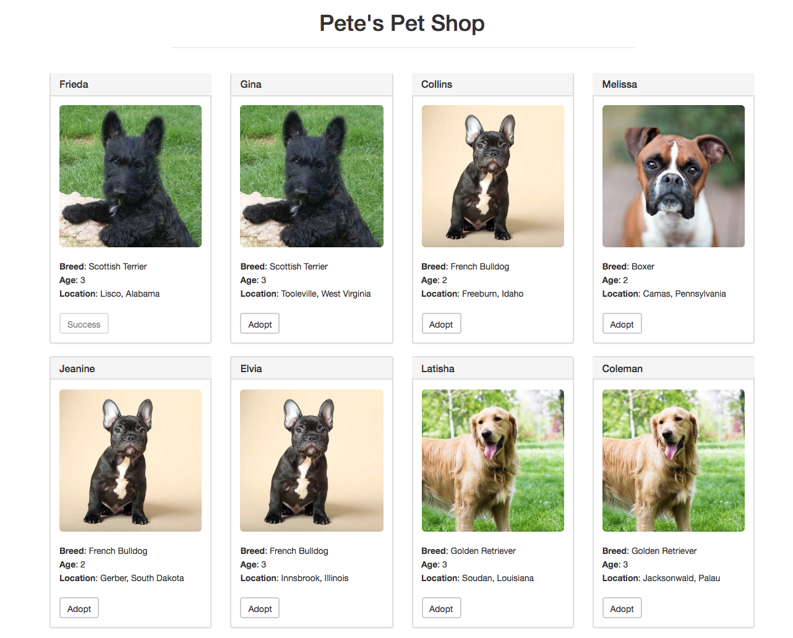
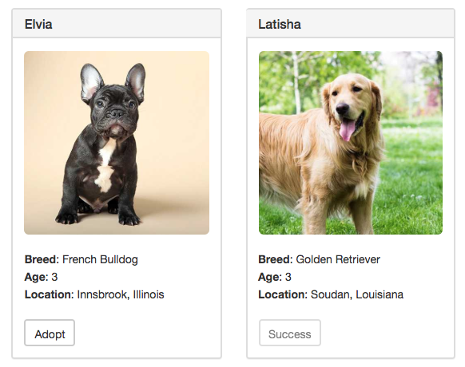

# Solidity Learning


## 1 build a simple contract using Solidity syntax (Tools:Remix,Ganache,MetaMask)


#### 1.1 A simple 'Counter' for counting including 'increment' and 'getNum'

```js
//specify solidity version
pragma solidity >=0.4.22 <0.6.0;

contract Counter{
    // unsigned int
    uint num;
    address owner;

    //declare as public
    constructor() public{
        num=0;
        owner=msg.sender;
    }

    function increment() public{
        if(owner!=msg.sender){
            num+=1;
        }
    }

    //view--only for read
    function getNum() public view returns (uint) {
        return num;
    }
}
```


#### 1.2 Put the code on Remix—Solidity IDE


#### 1.3 Download 'Ganache'

> Quickly fire up a personal Ethereum blockchain which you can use to run tests, execute commands, and inspect state while controlling how the chain operates.


Ganache quickly generated 10 accounts for testing and each of it owns 100 ETH.


#### 1.4 Add 'MetaMask' to google extension

import one account from 'Ganache'——copy address


#### 1.5 Deploy the 'Counter' contract and test

The gas fee is needed to pay by the creator of the transaction. In this contract, I need to pay gas for 'Increment' function because it changes values, but not for 'getNum' function because it is read only.

So, when I click 'increment', it charges me gas.


Then, the transaction will be logged


## 2 Follow Truffle toturial to build Ethereum Pet Shop (Solidity+Truffle+web3.js)

> Truffle is a world class development environment, testing framework and asset pipeline for blockchains using the Ethereum Virtual Machine (EVM)

[ Truffle toturial of building Ethereum Pet Shop](https://truffleframework.com/tutorials/pet-shop)



#### 2.1 "Adoption" - smart contract

```js
pragma solidity ^0.5.0;

contract Adoption{

    //Addresses are Ethereum addresses, stored as 20 byte values.
    address[16] public adopters;

    //adopt a pet
    function adopt(uint petId) public returns (uint){
        //ensure the ID is within range
        require(petId >= 0 && petId <= 15);

        //the address of the person or smart contract who called this function is denoted by msg.sender
        adopters[petId] = msg.sender;
        
        return petId;
    }

    //Retrieving the adopters
    function getAdopters() public view returns (address[16] memory){
        return adopters;
    }
}
```


#### 2.2 Migrate the contract to the blockchain

migrate the contract to the personal blockchain using 'Ganache'


#### 2.3 Smart contract testing

```js
pragma solidity ^0.5.0;

import "truffle/Assert.sol";
import "truffle/DeployedAddresses.sol";
import "../contracts/Adoption.sol";

contract TestAdoption{
    // The address of the adoption contract to be tested
    Adoption adoption=Adoption(DeployedAddresses.Adoption());
    uint expectedPetId=8;
    address expectedAdopter = address(this);

    //test the adopt() function
    function testUserCanAdoptPet() public{
        uint returnedId = adoption.adopt(expectedPetId);

        Assert.equal(returnedId,expectedPetId,"Adoption of the expected pet should match what is returned.");
    }

    //test retrieval of a single pet's owner
    function testGetAdopterAddressByPetId() public{
        address adopter=adoption.adopters(expectedPetId);

        Assert.equal(adopter,expectedAdopter,"owner of the expected pet should be this contract");
    }


    //test retrieval of all pet owners
    function testGetAdopterAddressByPetIdInArray() public{
        // store adopters in memory instead of contract's storage
        address[16] memory adopters=adoption.getAdopters();
        
        //using[], different from the previous one using adoption.adopters()
        Assert.equal(adopters[expectedPetId], expectedAdopter, "Owner of the expected pet should be this contract");
    }
}
```

Running the tests:


#### 2.4 create a user interface to interact with the smart contract using  'web3'

[web3.js API](https://web3js.readthedocs.io/en/1.0/)

> web3.js is a collection of libraries which allow you to interact with a local or remote Ethereum node, using an HTTP, WebSocket or IPC connection.

***can't fully understand the following code***

```js
//app.js—to manage the application
App = {
  web3Provider: null,
  contracts: {},

  init: async function () {
    // Load pets.
    $.getJSON('../pets.json', function (data) {
      var petsRow = $('#petsRow');
      var petTemplate = $('#petTemplate');

      for (i = 0; i < data.length; i++) {
        petTemplate.find('.panel-title').text(data[i].name);
        petTemplate.find('img').attr('src', data[i].picture);
        petTemplate.find('.pet-breed').text(data[i].breed);
        petTemplate.find('.pet-age').text(data[i].age);
        petTemplate.find('.pet-location').text(data[i].location);
        petTemplate.find('.btn-adopt').attr('data-id', data[i].id);

        petsRow.append(petTemplate.html());
      }
    });

    return await App.initWeb3();
  },

  initWeb3: async function () {
    // Modern dapp browsers...
    if (window.ethereum) {
      App.web3Provider = window.ethereum;
      try {
        // Request account access
        await window.ethereum.enable();
      } catch (error) {
        // User denied account access...
        console.error("User denied account access")
      }
    }
    // Legacy dapp browsers...
    else if (window.web3) {
      App.web3Provider = window.web3.currentProvider;
    }
    // If no injected web3 instance is detected, fall back to Ganache
    else {
      App.web3Provider = new Web3.providers.HttpProvider('http://localhost:7545');
    }
    web3 = new Web3(App.web3Provider);
    return App.initContract();
  },

  initContract: function () {

    $.getJSON('Adoption.json', function (data) {
      // Get the necessary contract artifact file and instantiate it with truffle-contract
      var AdoptionArtifact = data;
      App.contracts.Adoption = TruffleContract(AdoptionArtifact);

      // Set the provider for our contract
      App.contracts.Adoption.setProvider(App.web3Provider);

      // Use our contract to retrieve and mark the adopted pets
      return App.markAdopted();
    });

    return App.bindEvents();
  },

  bindEvents: function () {
    $(document).on('click', '.btn-adopt', App.handleAdopt);
  },

  markAdopted: function (adopters, account) {
    var adoptionInstance;

    App.contracts.Adoption.deployed().then(function (instance) {
      adoptionInstance = instance;

      return adoptionInstance.getAdopters.call();
    }).then(function (adopters) {
      for (i = 0; i < adopters.length; i++) {
        if (adopters[i] !== '0x0000000000000000000000000000000000000000') {
          $('.panel-pet').eq(i).find('button').text('Success').attr('disabled', true);
        }
      }
    }).catch(function (err) {
      console.log(err.message);
    });
  },

  handleAdopt: function (event) {
    event.preventDefault();

    var petId = parseInt($(event.target).data('id'));

    var adoptionInstance;

    web3.eth.getAccounts(function (error, accounts) {
      if (error) {
        console.log(error);
      }

      var account = accounts[0];

      App.contracts.Adoption.deployed().then(function (instance) {
        adoptionInstance = instance;

        // Execute adopt as a transaction by sending account
        return adoptionInstance.adopt(petId, { from: account });
      }).then(function (result) {
        return App.markAdopted();
      }).catch(function (err) {
        console.log(err.message);
      });
    });
  }

};

$(function () {
  $(window).load(function () {
    App.init();
  });
});
```

run it on 'lite-server':

opened in browser, shows what the page looks like


when you click 'Adopt' the Golden Retriever, you will be prompted to approve the transaction by MetaMask. Click submit, then the transaction has been approve. And you can see the status of Golden Retriever has been changed to 'Success'.

